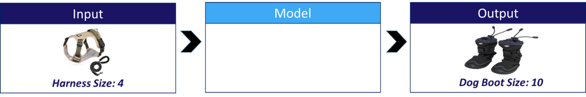
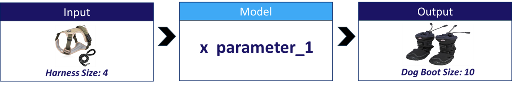
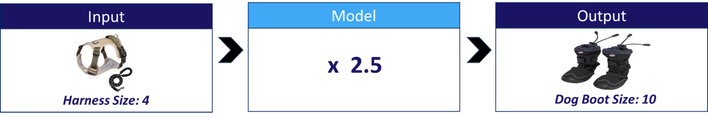
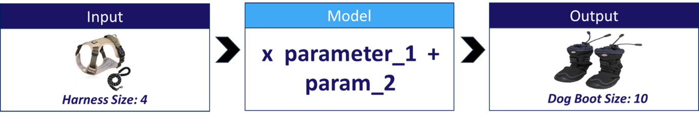
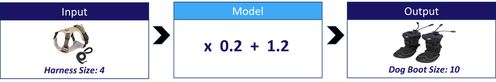
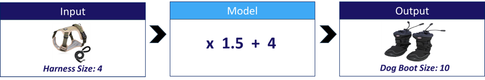

# ¿Qué pensar acerca de los modelos?
Podemos pensar de un modelo como una función que acepta datos como entrada y genera una salida. Más específicamente, un modelo usa los datos de entrada para estimar un resultado. Por ejemplo, en nuestro escenario, queremos crear un modelo al que se le proporciona una talla de arnés y calcula la talla de unas botas.

Debemos tomar en cuenta que la talla del arnés y el tamaño de la bota para perros son datos, no forman parte del modelo. La talla del arnés es la entrada y la talla de las botas para perros es la salida.

## Los modelos suelen ser código sencillo
Los modelos no suelen ser significativamente diferentes de las funciones simples con las que ya estamos familiarizados. Al igual que otros códigos, contienen lógica y parámetros. Por ejemplo, la lógica podría ser multiplicar el tamaño del arnés por *parameter_1*:

Si *parameter_1* aquí fuera *2.5*, nuestro modelo multiplicaría el *tamaño del arnés* por *2.5* y devolvería el resultado:

## Seleccionar un modelo
Hay muchos tipos de modelos, algunos simples y otros complejos.
Como todo código, los modelos más simples suelen ser los más confiables y fáciles de entender, mientras que los modelos complejos pueden potencialmente realizar hazañas impresionantes. El tipo de modelo que debemos elegir depende de nuestro objetivo. Por ejemplo, los científicos médicos a menudo trabajan con modelos que son relativamente simples, porque son confiables e intuitivos. Por el contrario, los robots basados en IA generalmente dependen de modelos complejos.

El primer paso en el aprendizaje automático es seleccionar el tipo de modelo que nos gustaría usar. Por lo tanto, elegimos un modelo en función de su lógica interna. Por ejemplo, podríamos seleccionar un modelo de dos parámetros para estimar el tamaño de la bota del perro a partir del tamaño del arnés:

Observa cómo seleccionamos un modelo en función de su funcionamiento lógico, pero no en función de los valores de sus parámetros. De hecho, en este punto, los parámetros no se han establecido en ningún valor en particular.

## Los parámetros se descubren durante el entrenamiento
El diseñador humano no selecciona los valores de los parámetros. En cambio, los valores de los parámetros se establecen en una estimación inicial y luego se ajustan durante un proceso de aprendizaje automático llamado ***entrenamiento***.

Dada nuestra selección de un modelo de dos parámetros, comenzamos proporcionando estimaciones aleatorias para nuestros parámetros:

Estos parámetros aleatorios significan que el modelo no es bueno para estimar el tamaño de la bota, por lo que realizamos un *entrenamiento*. Durante el *entrenamiento*, estos parámetros se cambian automáticamente a dos nuevos valores que brindan mejores resultados:

Exactamente cómo funciona este proceso es algo que explicamos progresivamente a lo largo del recorrido de aprendizaje.

